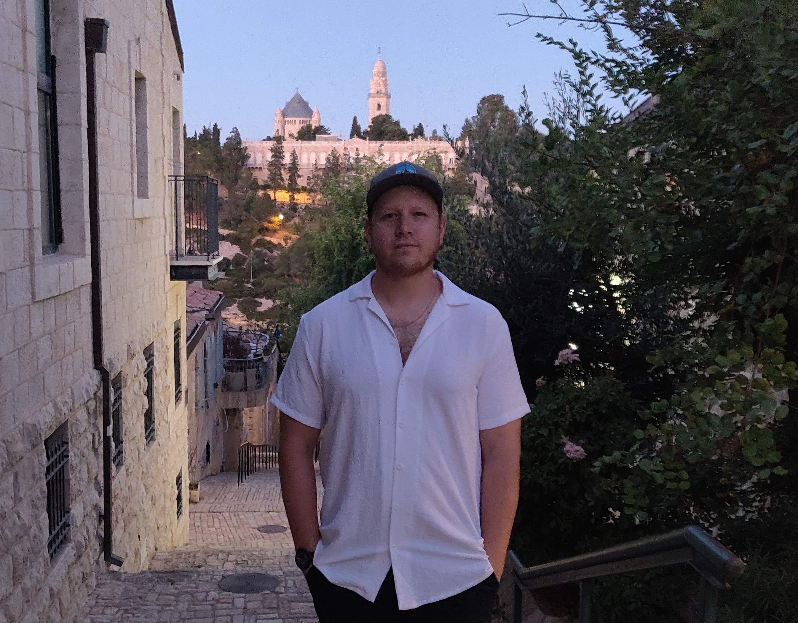

{:refdef: style="text-align: center;"}
{:height="300px" width="400px"}. 
{: refdef}

## Data Scientist

Trained as a computational cognitive scientist, I develop reinforcement learning and deep neural network algorithms to understand how humans and machines learn and plan. I seek to apply these methods in various ways, including basic research on how intelligent agents learn and plan, as well as applied problems that can use deep reinforcement learning for prediction and optimization.

## Skills

- Python Programming 
	- [Computational modelling](https://github.com/psharp1289/multigoal_RL)
- Machine Learning 
	- [Courses](https://www.coursera.org/account/accomplishments/certificate/CE3X3Q35HRHS)
- Bayesian statistical analysis 
	- [Jupyter Notebooks](https://github.com/psharp1289/hierarchical-bayesian-modeling/)
- Scientific writing, experimental design, computational modelling
	- [Google Scholar profile](https://scholar.google.com/citations?user=KXU4cS8AAAAJ&hl=en).

