## Study synopsis

The purpose of the following study was to design a cognitive task with optimal starting points for planning. Participants learned the cognitive map below by being randomly insterted into a specific image (e.g., car) and being instructed to take a specific action. This action deterministically transition them to a subsequent image, reflected in the black arrows below. Participants learned these 1-step transitions and were quizzed on them. They were told they could then use this knowledge to plan and win money in a later phase of the task. Note, these studies are pilot studies (Study 1 with time pressure n=14; Study 2 without time pressure n=16; Study 3 n=10).

{:refdef: style="text-align: center;"}
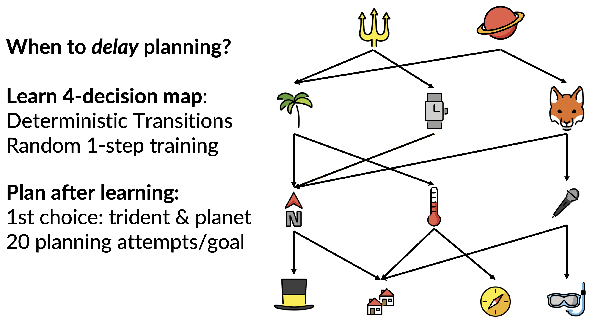. 
{: refdef}

## Planning depth determines when to start planning

Participants were told that they would always start by deciding between the top of the map -- here the trident or the planet. Their decision of which to choose is based on an instructed reward they could plan for. For example, they could be told 400 points is hiding behind the image of the snorkel, and they can use this goal to plan from the very first decision. As you see below, if the reward is at the snorkel, they NEED to start planning from their 1st of 4 decisions, because if they don't choose the trident, they cannot arrive at the snorkel. Therefore, the snorkel has a planning depth of 4, requiring all 4 decisions to be planned out starting from the very first decision. When participants took an action, they saw where they arrived, and could continue executing a plan or initiating a new plan.

{:refdef: style="text-align: center;"}
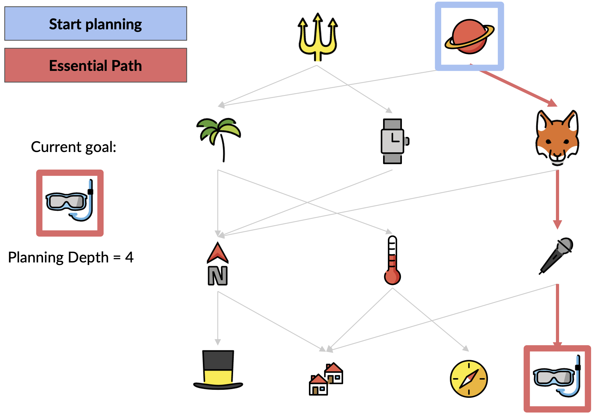. 
{: refdef}

Each goal had a different planning depth, such as the tophat which had a planning depth of 2 and only required planning to begin at the 3rd decision.

{:refdef: style="text-align: center;"}
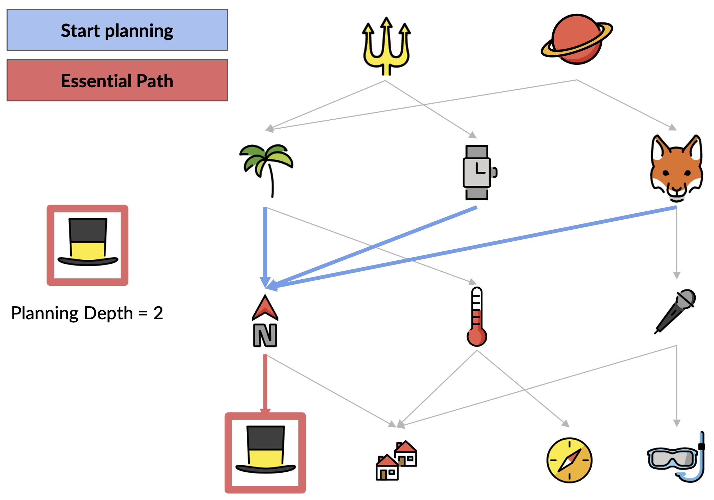. 
{: refdef}

## How we incentivized delayed planning

For each of the 4 decisions a participant faced during a planning trial, they were given the option to have the computer randomly choose their action for them, which would gift them 100 points. Thus, if they didn't need to plan at a given stage, they could give up control and win points for doing so. The predicted pattern for giving up control successfully inferred when to delay planning is depicted below. **Importantly** because we thought it may take participants a number of trials with a given goal to infer when to initiate planning, we had participants plan for each goal 20 separate times. Goals were instructed in random order. 

{:refdef: style="text-align: center;"}
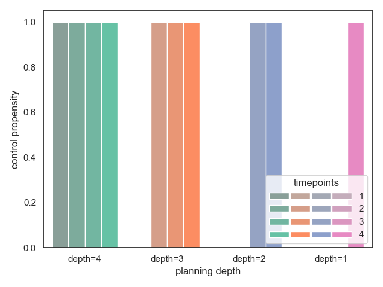. 
{: refdef}

## Failure to delay planning under time pressure

Remarkably, when participants were under time pressure, which in our task meant that the longer the took the less points they could get, they failed to delay planning when they should.

{:refdef: style="text-align: center;"}
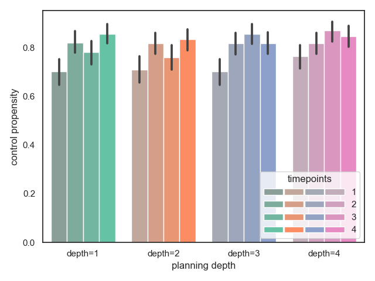. 
{: refdef}

## Worriers fail to plan under time pressure

Perhaps even more interesting, for subjects the reported they worried frequently, they failed to plan successfully at all under these stressful conditions. Here we measured if participants arrived at the instructed goal.

{:refdef: style="text-align: center;"}
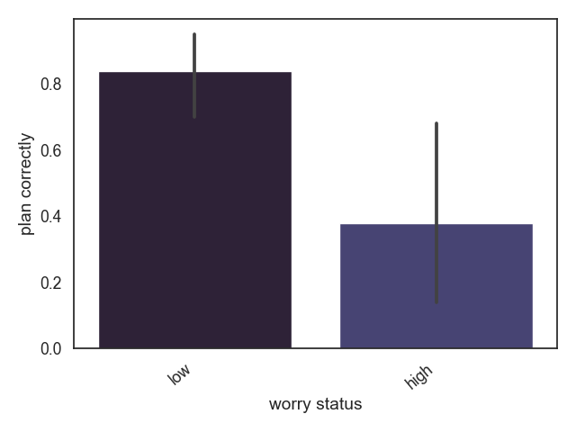. 
{: refdef}

## Humans infer when to start planning

When we removed the intense time pressure, we saw individuals in general infer when to delay planning

{:refdef: style="text-align: center;"}
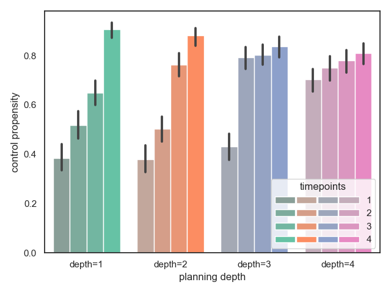. 
{: refdef}

## Replicating and extending our finding

We found that participants who failed to delay planning when they should, however, did so because they had a more difficult time planning in general. Specifically, they couldn't recall all the different routes of the cognitive map. We thus created a simpler 3-decision task where we ensured all participants knew how to plan every route throughout the map. Here's a picture of the new map they had to learn below. Note we didn't have them plan for the houses, as it had the same planning depth as microphone.

{:refdef: style="text-align: center;"}
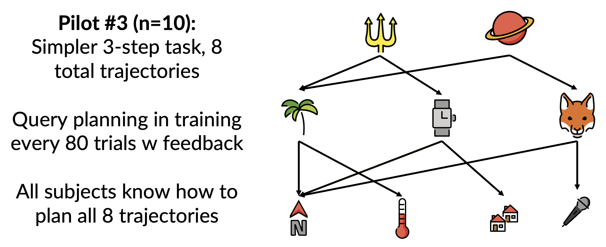. 
{: refdef}

## Again they infer when to start planning

Again participants inferred when to initiate planning. Here you see they average behavior resembles the optimal prediction for planning intiation time. 

{:refdef: style="text-align: center;"}
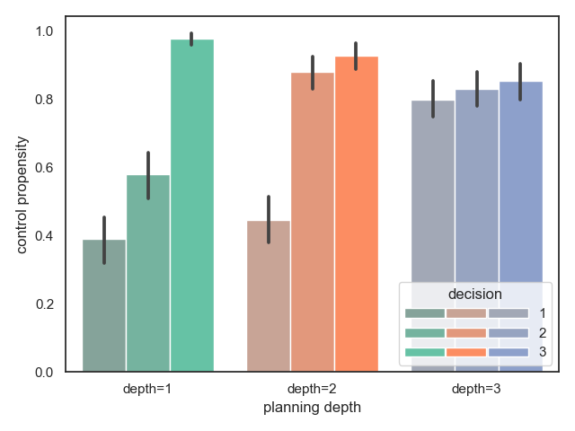. 
{: refdef}

## Inference to intiate planning is *rapid*

We inspected how particiapnts delayed control for each goal over time, since they had 20 opportunities to plan for each possible goal. Note, for most particiapnts, their decision to initiate planning at a given timepoint does not change that much over these 20 trials. This suggests humans can **rapidly** infer when to initiate planning. What you see below is every subject that successfully delayed planning (60% of subjects) performance on the task as a function of both the goal depth, and time (number of trials).

{:refdef: style="text-align: center;"}
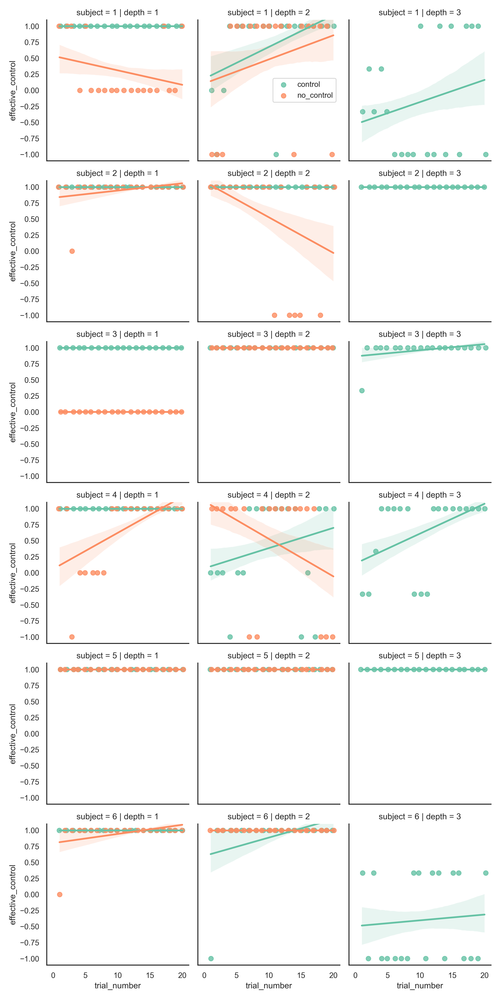. 
{: refdef}

## Delayed control = delayed planning

A large potential confound in the study is that when participants gave up control at certain early decisions, they didn't **actually delay their planning**. To show this, we need evidence that participants indeed had greater reaction times at the decision point where they had to start planning, since planning takes time! To estimate whether this occurred, we modelled participants' reaction time as a function of several causes of more or less reaction time. Specifically, we used a hierarchical Bayesian regression to explain RT as a function of the following variables. Note below, variable 1 test our main hypothesis that subjects in fact delayed planning:

1. Optimally delayed planning (Initiate planning optimally if there’s behavioral evidence they also gave up control at that time).
2. trial number (learning)
3. depth of planning for each goal ()
4. decision point 
5. goal-switch 
6. Later trials requiring planning (excluding optimal starting points)

As you can see, Variable 1 was highly significant in the predicted direction. The timepoint at which individuals should start planning did indeed have greater reaction time than all other timepoints. 

{:refdef: style="text-align: center;"}
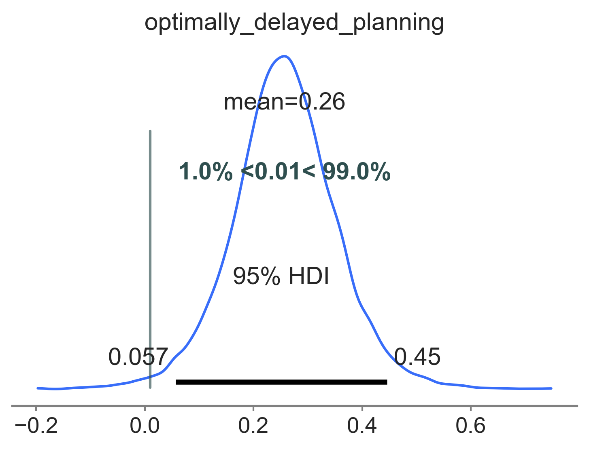. 
{: refdef}

## Chronic worry is associated with impaired inference to delay planning 

A motivating clinical hypothesis that we investigated is whether individuals that worry frequently over-use planning. Intuitively we know such individuals are constantly planning how to avoid dangerous futures even when it isn't helpful to do so. We indeed show here for the first time that the more one worriers, the worse one is at delaying planning. We created a continuous score on the y-axis which measures if participants delayed control when they should and engaged control when they should. Importantly this replicates a correlation we found above in the more complicated 4-decision task. The correlation specifically is -0.659.

{:refdef: style="text-align: center;"}
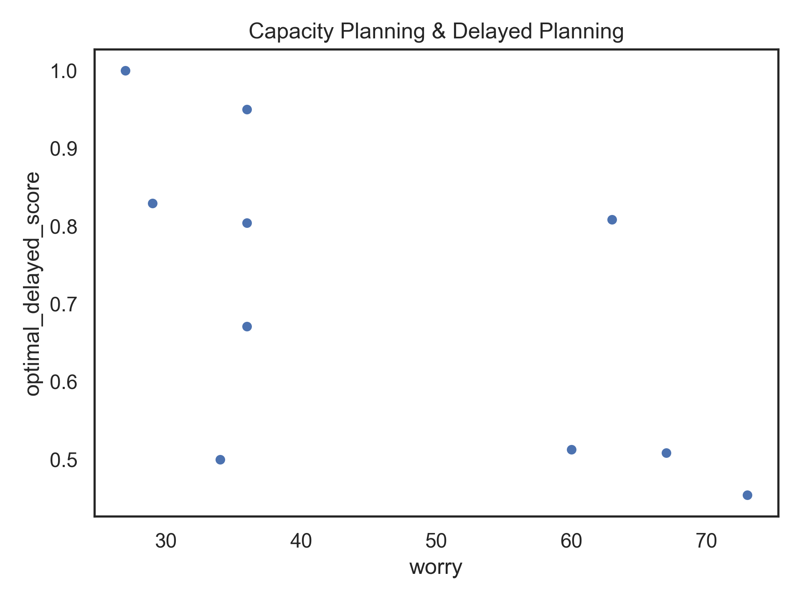. 
{: refdef}