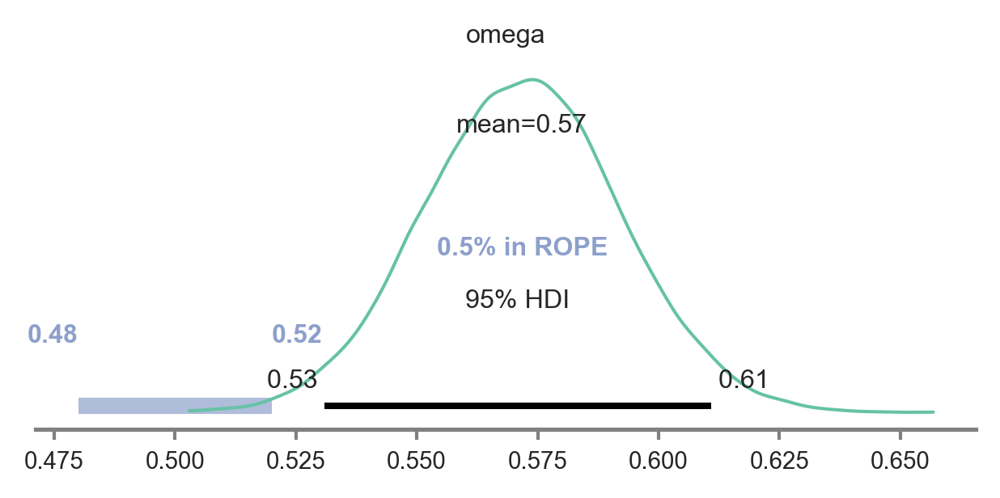
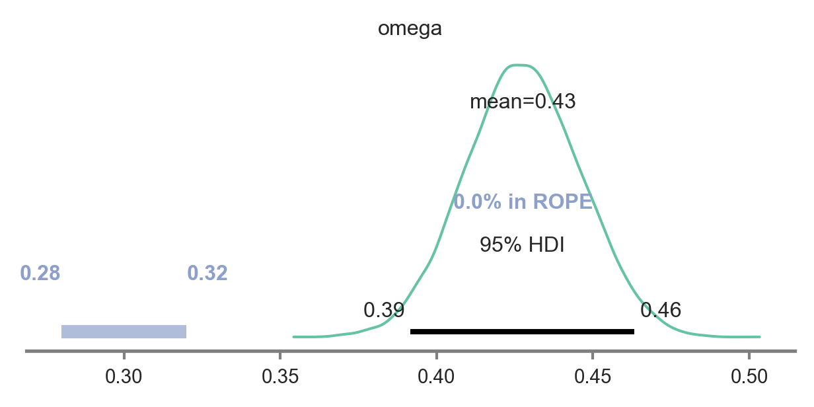
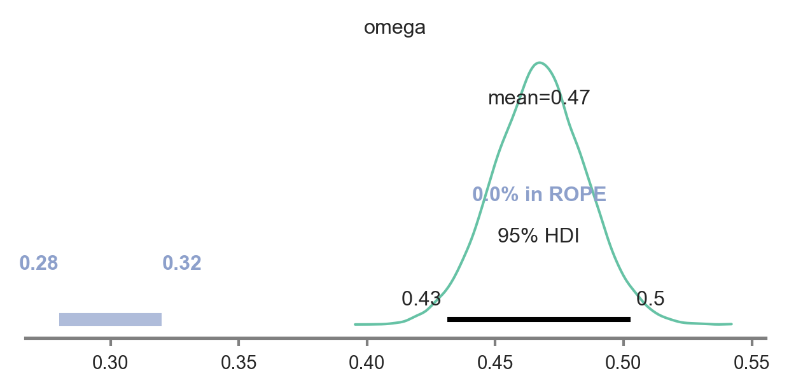
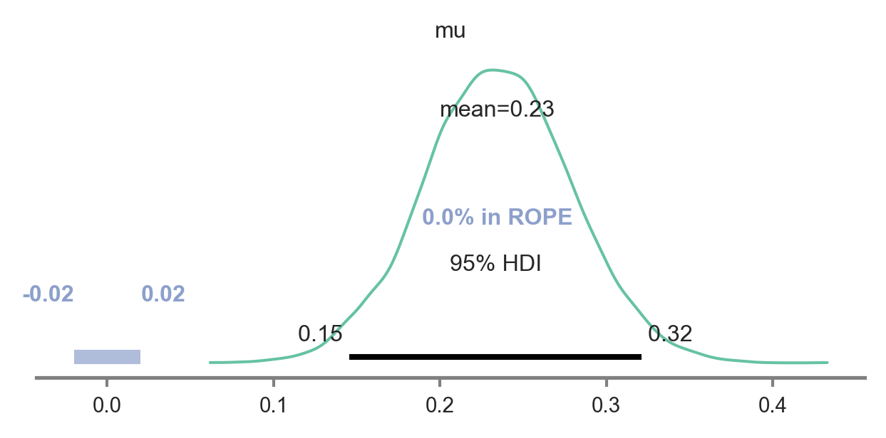

# Load data


```python
#load dependencies
import numpy as np
from IPython.display import Image
from matplotlib import gridspec
import pandas as pd
import numpy as np
import pymc3 as pm
import matplotlib.pyplot as plt
import seaborn as sns

sns.set(style='white', palette='Set2', font='arial', font_scale=1.0, rc=None)

df=pd.read_csv('all_planning_questions.csv') #load data
#print means of each key variable
print(df.mean())

#Convert percentage of each key variable to number of successes out of 8 choices
#The purpose of this is to transform the data such that it can be modelled by a binomial likelihood
PR_evidence=df['PR Evidence']*8
distal_bias=df['distal_bias']*8
action_bias=df['bias_left_side']*8

# Print 0.1*SD of PR Evidence to define the ROPE
print('ROPE of PR EVIDENCE: {}'.format(0.1*df['PR Evidence'].std()))

```

    PR Evidence       0.566441
    bias_left_side    0.468468
    distal_bias       0.430180
    rwd_reval         0.894144
    trn_reval         0.575450
    dtype: float64
    ROPE of PR EVIDENCE: 0.01829522881014056


# Fit Model for Hypothesis 1: Evidence for PR-based Planning

Below we fit the beta-binomial described in text to choice data for Variable 1, which defines the number of times participants chose in line with PR-based planning. If omega, the mode of the group distribution, is estimated to be significantly greater than 0.5 (no evidence of PR-based planning), then we conclude evidence for our main hypothesis.

We followed Kruschke’s (2014) guidelines to derive the ROPE, wherein we took the standard deviation of the percentage of times subjects chose in line with PR-based planning and multiplied this value by 0.1 , which was 0.18, and multiplied this by 0.1, to define effects that are too small to be considered significant. We then rounded this up to 0.2 to make it even a bit more conservative than Kruschke’s (2014) recommendation. We use this ROPE for all subsequent analyses.

Note below, we fit the same model to the two subsequent manipulation checks, except include different variables (specifically, variables 3 and 5 as described in the preregistration).


```python
n_subjects = 111
subjects= [*range(111)]
with pm.Model() as hierarchical_model:
    omega = pm.Beta('omega', 1., 1.)
    kappa_minus2 = pm.Gamma('kappa_minus2', 1.105125 , 0.1051249, transform=None)
    kappa = pm.Deterministic('kappa', kappa_minus2 + 2)
    
    theta = pm.Beta('theta', alpha=omega*(kappa-2)+1, beta=(1-omega)*(kappa-2)+1, shape=n_subjects)

    y = pm.Binomial('y',n=8,p=theta[subjects], observed=PR_evidence) 
    
with hierarchical_model:
    trace_main = pm.sample(draws=4000, target_accept=0.99,init='adapt_diag')
```

## Posterior distribution for group-level tendency to choose in line with PR-based planning

As you see below, the parameter omega defining the group-level tendency to choose in line with PR-based planning was significantly greater than the null value of 0.5. Specifically, the posterior highest density interval does not contain any values in the pre-defined region of practical equivalence, defining values similar-enough to 0.5 to be considered null effect sizes. 


```python
import arviz as az
az.plot_posterior(
    trace_main,
    var_names=['omega'],
    hdi_prob=0.95,
    rope=[0.48,0.52],
    figsize=[5,2]
);

plt.savefig('omega_PRevidence_posterior_betabinomial.png', bbox_inches='tight',  dpi=300)
plt.show()
```


    
{:refdef: style="text-align: center;"}
{:height="400px" width="400px"}. 
{: refdef}    


# Fit model for manipulation check 1: Bias for distal reward?


```python
n_subjects = 111
subjects= [*range(111)]
with pm.Model() as hierarchical_model:
    omega = pm.Beta('omega', 1., 1.)
    kappa_minus2 = pm.Gamma('kappa_minus2', 1.105125 , 0.1051249, transform=None)
    kappa = pm.Deterministic('kappa', kappa_minus2 + 2)
    
    theta = pm.Beta('theta', alpha=omega*(kappa-2)+1, beta=(1-omega)*(kappa-2)+1, shape=n_subjects)

    y = pm.Binomial('y',n=8,p=theta[subjects], observed=distal_bias) 
    
with hierarchical_model:
    trace_distal = pm.sample(draws=4000, target_accept=0.99,init='adapt_diag')
```

## Plot posterior for omega: The highest-density interval (black line) in the posterior does not include 0.3 or 0.7. 

Manipulation check passed!


```python
import arviz as az
az.plot_posterior(
    trace_distal,
    var_names=['omega'],
    hdi_prob=0.95,
    rope=[0.28,0.32],
    figsize=[5,2]
);

plt.savefig('omega_posterior_distalbias_betabinomial.png', bbox_inches='tight',  dpi=300)
plt.show()
```

{:refdef: style="text-align: center;"}
{:height="400px" width="400px"}. 
{: refdef}
    


# Fit model for manipulation check 2: Bias for left-wards action?


```python
n_subjects = 111
subjects= [*range(111)]
with pm.Model() as hierarchical_model:
    omega = pm.Beta('omega', 1., 1.)
    kappa_minus2 = pm.Gamma('kappa_minus2', 1.105125 , 0.1051249, transform=None)
    kappa = pm.Deterministic('kappa', kappa_minus2 + 2)
    
    theta = pm.Beta('theta', alpha=omega*(kappa-2)+1, beta=(1-omega)*(kappa-2)+1, shape=n_subjects)

    y = pm.Binomial('y',n=8,p=theta[subjects], observed=action_bias) 
    
with hierarchical_model:
    trace_action = pm.sample(draws=4000, target_accept=0.99,init='adapt_diag')
```

## Plot posterior for omega: The highest-density interval (black line) in the posterior does not include 0.3 or 0.7. 

Manipulation check passed!


```python
import arviz as az

az.plot_posterior(
    trace_action,
    var_names=['omega'],
    hdi_prob=0.95,
    rope=[0.28,0.32],
    figsize=[5,2]
);
plt.savefig('omega_posterior_actionbias_betabinomial.png', bbox_inches='tight',  dpi=300)
plt.show()
```

{:refdef: style="text-align: center;"}
{:height="400px" width="400px"}. 
{: refdef}
    

# Bayesian power analysis (e.g., Kruschke, 2014)

1. Sample random indices from each parameter distribution for sample size n=111
    a. once for group-level distributions, 111 times for individual-level distributions
2. Generate data based on these parameters
3. Fit hierarchical logistic regression model run above
4. compute mode and HDI.
5. Repeat 300 times
6. Tally how many times HDI does not contain pre-defined ROPE to estimate power. 


```python
successes=0 #number of times posterior did not include key value from ROPE
num_iterations=300
for i in range(300): # fit model 300 times
    sample_omega=np.random.choice(trace.omega, size=1)[0]
    sample_kappa=np.random.choice(trace.kappa,size=1)[0]
    sample_alpha=sample_omega*(sample_kappa-2)+1
    sample_beta=(1-sample_omega)*(sample_kappa-2)+1

    thetas=np.random.beta(sample_alpha,sample_beta,111)
    sample_data=[]
    for theta in thetas:
        sample_data.append(np.random.binomial(8,theta,1))
    n_practitioners = 111
    subjects= [*range(111)] 
    with pm.Model() as hierarchical_model:
        omega_s = pm.Beta('omega_s', 1., 1.)
        kappa_minus2_s = pm.Gamma('kappa_minus2_s', 1.105125 , 0.1051249, transform=None)
        kappa_s = pm.Deterministic('kappa_s', kappa_minus2_s + 2)

        theta_s = pm.Beta('theta_s', alpha=omega_s*(kappa_s-2)+1, beta=(1-omega_s)*(kappa_s-2)+1, shape=n_practitioners)

        y = pm.Binomial('y',n=8,p=theta_s[subjects], observed=sample_data) 

    with hierarchical_model:
        trace_main = pm.sample(draws=4000, target_accept=0.99,init='adapt_diag')
    
    df_summary_s=az.summary(trace_s,var_names=['omega_s'],hdi_prob=0.95)
    if df_summary_s['hdi_2.5%'].values[0]>0.52:
        successes+=1

bayesian_power=successes/num_iterations
```

# Transition and Reward Revaluation: Load and visualize data


```python
import numpy as np
import pandas as pd
import math
from matplotlib.pyplot import figure
figure(figsize=(2, 2), dpi=300)

#sigmoid function
def sigmoid(x):
    return 1 / (1 + math.exp(-x))

#load data
df=pd.read_csv('beta_binomial_transitionReval_firstencounters2.csv')

#plot transition revaluation performance
df1=df['choice_trn_reval']
ax=df1.plot.hist(bins=20, alpha=0.5)

#plot reward revaluation performance
df2=df['choice_rwd_reval']
ax=df2.plot.hist(bins=20, alpha=0.5)


plt.legend(['trn reval', 'rwd reval'])
plt.show()
```

## Calculate cost of Transition Revaluation and subtract it from cost of Reward Revaluation for each subject 


```python
cost_TR=df['choice_rwd_reval']-df['choice_trn_reval']
cost_RR=1-df['choice_rwd_reval']
effect_TR=cost_TR-cost_RR #subtract cost of reward reval from cost of transition revaluation
```

## Fit model to determine if the cost of transition revaluation is significantly greater than the effect of reward evaluation


```python
from pymc3 import HalfCauchy, Model, Normal, glm, plot_posterior_predictive_glm, sample

subjects= [*range(111)]
with pm.Model() as model_effect_TR:  # model specifications in PyMC3 are wrapped in a with-statement
    # Define priors
    sigma = HalfCauchy("sigma", beta=10, testval=1.0)
    mu = Normal("mu", 0, sigma=20)

    # Define likelihood
    likelihood = Normal("y", mu=mu, sigma=sigma, observed=effect_TR)
    
with model_effect_TR:
    trace_effect_TR = pm.sample(draws=4000, target_accept=0.9999,init='adapt_diag')
```


```python
 # Extract posterior and plot
import arviz as az
az.plot_posterior(
    trace_effect_TR,
    var_names=['mu'],
    hdi_prob=0.95,
    rope=[-.02,0.02],
    figsize=[5,2]
);
plt.savefig('effect_TR.png', bbox_inches='tight',  dpi=300)
plt.show()

```

{:refdef: style="text-align: center;"}
{:height="400px" width="400px"}. 
{: refdef}
    

