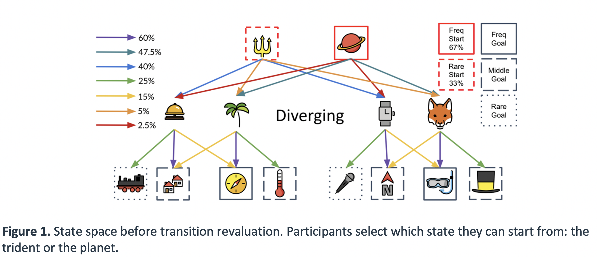
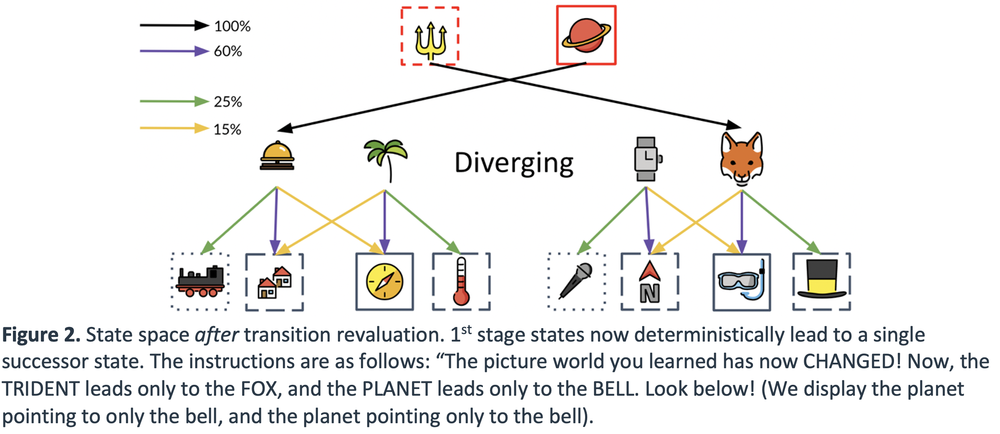

## Project description

Little work in RL-based studies of planning has formalized algorithms for backwards planning and their advantages over algorithms for forwards planning. Prior work in experimental psychology, however, has demonstrated humans have a general bias towards backwards planning (Park, Lu & Hedgcock, 2017, Psychological Science). The present study will investigate whether humans utilize an efficient form of backwards planning that we term a predecessor representation (PR). Like a successor representation (SR), a predecessor representation encodes long-run expectations of state occupancies given current states and actions taken. However, unlike a successor representation which predicts future state occupancies, a predecessor representation predicts past state occupancies. In the present study, we use simulations of the conditions under which PR-based planning would lead to better outcomes than SR-based planning or even more complex model-based (MB) planning, to develop a task to test whether individuals utilize PR-based planning. To demonstrate the likelihood that our predictions will be observed in our preregistered study, we describe below pilot data fa large study (n=111) supporting our main hypothesis that individuals do indeed use PR-based planning, as well as the details of the planning task, our hypothesis, and the methods used to analyze the data we plan to collect. See the full details of our preregistration here: [OSF Repository](https://osf.io/s286z/)

    
{:refdef: style="text-align: center;"}
. 
{: refdef} 

## Study design

Variables
We will measure participants’ planning-based behavior using queries described in the task below, and determine whether their behavior aligns with PR-based planning or guessing. 

Measured variables
Task: Participants first complete 480 trials of a forced choice learning phase to ensure they know the state space and transitions well, and that each participant sample the same number of times from each state transition in the state space. Every 30 or so trials during this forced choice learning phase, participants are given a memory quiz where they must choose one of the two first-stage states that has the best chance of transitioning them to a 3rd stage state. We ensure in the piloting that our state space produced very good memory of the state space (average 93% on these memory probes).

After this planning phase, participants face planning queries that ask them to use what they learned about the probability of transition to certain states in the preceding training phase to win the most money. We explicitly tell participants that they should consider going for smaller rewards if they believe they have a much greater chance to reach those states than more highly rewarded but rare states (i.e., we encourage them to incorporate both the instructed reward magnitude and learned probabilities of state transitions into their planning process).

For each planning query, 2 to 4 reward locations are instructed on the screen, and the participant is told to use this reward information to choose an action that will maximize their reward. In order to do so, they should use what they have learned about the state space in the preceding training phase, which determines the likelihood of transitioning to successive states given an initial action. Participants know that if they reach a location, they will receive the reward found there (i.e., the reward function is deterministic). However, participants are never shown whether they receive the reward; they are merely told the computer is simulating whether they in fact reached the reward, and this will affect the bonus money they receive at the experiment’s conclusion. This is intended to keep learning unaffected by reward receipt, removing the possibility that model-free learning impacts subsequent decisions. Participants are given unlimited time to deliberate before taking an action.

We designed our task to specifically incentivize PR-based planning versus other forms of planning by hand-crafting specific planning queries that produce large action value differences between available choices according to PR-based planning, but no action value differences according to SR- or MB-based planning. For example, a planning query based on using a PR representation of the state space might predict action 1 is most likely to acquire the most reward, whereas planning based on an SR representation would predict action 2 and action 1 are equally likely to acquire the most reward. Thus, each planning query compares a strong prediction made by PR-based planning to behavior generated by an agent that is guessing. We intend to test in future studies whether individuals use PR-based planning when SR- and MB-based planning are equivalently incentivized.  

These predictions of action value differences according to PR-based planning versus SR- or MB-based planning were carried out via simulation studies. In our simulations, PR and SR matrices were derived by an agent that sampled transitions under a random policy, and computed the observed transition frequencies via recursive updates with a learning rate that declines with each sample from a given state-action pair. Because this sampling was done extensively (over 10,000,000 experiences), the resultant PR and SR matrices very closely approximate the true PR and SR probabilities. 

Once the PR is acquired, there are several ways an agent can use a PR to plan. In the set of simulations we performed to design our task, we account for two possible ways in which agents might use a PR to plan. One way, which we call “PR-many”, is by summing across all rewards PR-probability products to generate action values. Alternatively, agents can use a PR to pursue only a single reward for each action (which we call, “PR-one”), where agents define an action’s value according to the greatest PR probability * reward magnitude product. 

We use sets of planning queries to determine whether agents are using PR-based planning. For each planning query comprising variable 1 below (testing our main hypothesis), we ensured in simulation that PR-many and PR-one made the same action prediction according to the same difference in action value between the two available actions. We designed several additional sets of planning queries used to rule out confounding factors affecting participant behavior, which we delineate below:

(i) Evidence participants utilize a PR vs. guessing (variable 1),
(ii)    Evidence participants can perform transition revaluation using backwards-MB (variable 2)
(iii)   Evidence participants have a bias for immediate vs. distal rewards when planning (variable 3)
(iv)    Evidence participants can perform reward revaluation using any approximate (SR PR) strategy (variable 4)
(v) Evidence participants have a bias to select the left or right action (variable 5). 

For variable 1, we ensured PR-based planning had no preference for immediate or distal rewards. Specifically, in half of the planning queries used to measure variable 1, PR-based planning prefers the action that leads to the immediate reward location in half the queries and distal reward the other half of queries.

In the subsequent planning queries used to estimate reward and transition revaluation (variables 2 and 4), only a single distal reward location is presented to participants. The reward revaluation comprises planning after learning the original transition structure, and the transition revaluation planning queries occur after participants are instructed about a change to the transitions between 1st and 2nd stage images. The reason for changing 1st to 2nd stage transitions unlike Momennejad et al. (2017) who changed 2nd to 3rd stage transitions is because the former cannot be handled by PR (whereas changing 2nd-3rd transitions may, because 2nd-stage states have intact predictions of 1st-stage predecessors).

To estimate the cost of transition revaluation on performance, we subtract performance after transition revaluation from performance on similar queries before it. We compare this transition revaluation cost to an upper bound estimate of the cost of reward revaluation on performance, computed by subtracting performance on queries coming after reward revaluation from the optimal possible planning performance (i.e., a score of 1). 

Since learning the task state space requires 480 learning trials, each participant will only learn one state space, based on which both reward and transition revaluation will be tested. To fully isolate reward revaluation from transition revaluation, reward revaluation must not be based on transitions that were themselves recently revaluated. For this reason, we will first test subjects on reward revaluation and only then on transition revaluation. 

Although transition revaluation occurs second always, we regard a potential order effect as inconsequential on both logical and empirical grounds. First, both revaluation phases are temporally short (on the order of 1 minute), come one after the other, and are thus both experienced with roughly the same time delay from the initial learning phase (and are thus equally susceptible to forgetting). Second, we found in our pilot data that transition revaluation incurs a high cost that brings planning performance down to chance levels. Therefore, if transition revaluation occurs first, we would be unable to detect any meaningful signal in reward revaluation, as the latter would be contingent on successfully planning with the revalued transitions.

For comparability, both reward and transition revaluation involve deterministic changes. Specifically, if participants reach a new instructed reward, they are guaranteed to receive that reward. Similarly, the changes that are instructed about the state space are deterministic: each starting state only leads to one successor at the 2nd stage.

Note, we did not include a control version of the task as is done in previous tasks (e.g., Momennejad et al., 2017) because in piloting we found no difference in performance during consecutive phases of reward revaluation (that mirrors the time delay between reward and transition revaluation phases in the task). Thus, we rule out that forgetting could explain the dramatic performance loss we observed in piloting due to the additive effect of transition revaluation.

Variable 1: evidence of PR versus guessing (8 questions). 1 = complete evidence of PR; 0.5 or less = evidence of guessing.

Variable 2: evidence of transition revaluation using backwards-MB (4 questions). 1 =complete evidence of backwards-MB, 0.5 = guessing, 0= complete evidence of PR.

Variable 3: evidence of immediate versus distal reward bias (8 questions): 1=complete evidence of distal bias, 0.5=no bias, 0=complete evidence of immediate bias.

Variable 4: evidence of reward revaluation (4 questions). 1 =complete evidence of reward revaluation, 0.5 or less = guessing. 

Variable 5: evidence of action bias (8 questions): 1=complete evidence of left-wards bias, 0.5=no bias, 0=complete evidence of right-wards bias.

Of note, the reason why variables 2 and 5, comprising reward and transition revaluation respectively, have only 4 questions, is because after the transition revaluation (Figure 2), actions only lead to 4 possible goals. Therefore, to ensure participants can feasibly choose an optimal action, and goals do not repeat (which may require no planning), we have participants face the only 4 possible goals they can reach each query. 

    
{:refdef: style="text-align: center;"}
. 
{: refdef} 

## Modelling

Main hypotheses 
Evidence of PR: We model the 8 choices participants made during planning queries comprising Variable 1 using a hierarchical beta-binomial model, that estimates the degree to which participants chose in line with PR-based planning predictions. A beta distribution at the group level defines the tendency of the group to choose in line with PR-based planning, which increases as the expected value of the beta distribution gets closer to 1. This group-level tendency is defined by its mode, and the spread of possible parameter values around the mode is captured by the distribution’s concentration. These central tendencies are recommended for beta distributions (Kruschke, 2014). In the hierarchical model, both the prior distribution of the group-level mode and concentration (i.e., the hyperpriors) are scaled to the data via BAMBI’s software default algorithm (Carpetto et al., 2020). At the subject-level, the binomial parameter is drawn from the group-level beta distribution, which defines the tendency of that individual to choose in line with PR-based planning. Finally, a binomial likelihood serves to account for the 8 choices each participant made.

We test our hypothesis by extracting the mode of the posterior group-level beta distribution, which defines the population’s tendency to choose in line with PR-based planning, and comparing the mode to a range of null values. A value of 1 for the mode indicates subjects chose perfectly in line with PR-based planning, and 0.5 or below indicates guessing. We define a region of practical equivalence (ROPE) around the null value of 0.5 following Kruschke’s (2014) guidelines. Specifically, we take the standard deviation of the percentage of times subjects chose in line with PR-based planning and multiplied this value by 0.1 to define effects that are too small to be considered significant. Statistical significance is defined by the highest-density interval (HDI) being entirely non-overlapping with the ROPE.

One additional test is necessary to support our main hypothesis, specifically, to show that there is only partial evidence of MB use, substantially less than what would be expected under the hypothesis that subjects only employ MB, implicating a hybrid use of backwards-MB and PR (similar to previous report of hybrid use of SR and forwards-MB; Momennejad et al., 2017). To test this, we examine whether the cost of transition revaluation (specifically, the difference between planning accuracy after transition revaluation and planning accuracy during the preceding reward revaluation), which MB agents can successfully handle, is greater than an upper bound estimate of the cost of reward revaluation (specifically, the difference between optimal planning accuracy – 100% – and planning accuracy during reward revaluation), which PR and MB agents can successfully handle.

We use a simple Bayesian model to estimate the mean of the difference between the cost of transition revaluation minus the cost of the reward revaluation, where this mean difference is drawn from a normal distribution with prior mean and variance on the scale of the data. 

The main hypothesis tests and the below manipulation checks received empirical support from our initial pilot (n=111), which we detail with full data, models and results in the document entitled, “modelling_pilot_1.docx”. 

Manipulation Checks
We will conduct two manipulation checks to ensure participants did not neglect either immediate or distal rewards, or present with a substantial bias to choose one of the two available actions (left or right). 

We will fit the same beta-binomial hierarchical model described to model evidence for our main hypothesis two additional times to estimate the group-level tendency to display either an (1) action or (2) distal reward bias. The only difference in this model is that the choice data being modelled will come from Variables 3 and 5.  If the HDI of the mode of the group level posterior distribution defining the tendencies to show these biases includes 0.3 (immediate reward bias/right-ward bias) or 0.7 (distal reward bias/left-ward bias), our task will have failed the distance bias manipulation check.  

Transformations
Below we describe exactly how we transform the raw data into the variables noted above.

Evidence of PR use when facing multiple rewards and goals: There are 8 questions that will determine evidence for PR at the planning stage. If the individual chose actions that correspond to actions a PR-based planning agent would choose, it will be coded as 1 and 0 otherwise. 

Reward Revaluation Performance: There are 4 questions that will determine reward revaluation capacity at the planning stage. Each query presents a single distal reward with high value for the participant to plan to reach. A 1 indicates choosing the action that can best get them to that reward (irrespective of PR, SR, or MB use), and a 0 indicates a failure to choose the action that can best get them to that reward. As described above, all actions based on SR- PR- or MB-based planning were determined in simulation studies, assuming an agent learned transition as they will be experienced in the present task.

Transition revaluation performance: There are 4 questions that will determine evidence backwards-MB vs. PR usage at the planning stage. Note these queries come after a transition revaluation phase, where participants are instructed that 1st to 2nd stage state transitions have changed and are now deterministic; i.e., each 1st stage state now only leads to one possible successor 2nd stage state.  If the individual chose actions that correspond to actions a PR-based planning agent would choose, it will be coded as 0, and if they chose actions that correspond to actions a backwards-MB-based planning agent would choose, it will be coded as 1. 

Distal bias: There are 8 questions that will determine evidence distal vs. immediate reward bias during the planning stage. Importantly, PR- SR- and MB-based planning predictions are equivalent on these trials, allowing us to assess whether, despite those predictions, individuals simply want to attain immediate or distal rewards. If the individual chose actions that are most likely to lead to an immediate reward according to any strategy, it will be coded as 0, and if they chose actions that are most likely to lead to a distal reward according to any strategy, it will be coded as 1. 

Action bias: To determine evidence of action bias during the planning stage, we utilize the same 8 questions as used for distal bias but analyzed slightly differently. Given advantageous actions (e.g., pressing left vs. pressing right) were evenly distributed across immediate and distal bias queries, we can control for distance bias when assessing action bias. If the individual chose the left action, it will be coded as 1, and if they chose the right action, it will be coded as 0. 


## Load data


```python
#load dependencies
import numpy as np
from IPython.display import Image
from matplotlib import gridspec
import pandas as pd
import numpy as np
import pymc3 as pm
import matplotlib.pyplot as plt
import seaborn as sns

sns.set(style='white', palette='Set2', font='arial', font_scale=1.0, rc=None)

df=pd.read_csv('all_planning_questions.csv') #load data
#print means of each key variable
print(df.mean())

#Convert percentage of each key variable to number of successes out of 8 choices
#The purpose of this is to transform the data such that it can be modelled by a binomial likelihood
PR_evidence=df['PR Evidence']*8
distal_bias=df['distal_bias']*8
action_bias=df['bias_left_side']*8

# Print 0.1*SD of PR Evidence to define the ROPE
print('ROPE of PR EVIDENCE: {}'.format(0.1*df['PR Evidence'].std()))

```

    PR Evidence       0.566441
    bias_left_side    0.468468
    distal_bias       0.430180
    rwd_reval         0.894144
    trn_reval         0.575450
    dtype: float64
    ROPE of PR EVIDENCE: 0.01829522881014056


## Fit Model for Hypothesis 1: Evidence for PR-based Planning

Below we fit the beta-binomial described in text to choice data for Variable 1, which defines the number of times participants chose in line with PR-based planning. If omega, the mode of the group distribution, is estimated to be significantly greater than 0.5 (no evidence of PR-based planning), then we conclude evidence for our main hypothesis.

We followed Kruschke’s (2014) guidelines to derive the ROPE, wherein we took the standard deviation of the percentage of times subjects chose in line with PR-based planning and multiplied this value by 0.1 , which was 0.18, and multiplied this by 0.1, to define effects that are too small to be considered significant. We then rounded this up to 0.2 to make it even a bit more conservative than Kruschke’s (2014) recommendation. We use this ROPE for all subsequent analyses.

Note below, we fit the same model to the two subsequent manipulation checks, except include different variables (specifically, variables 3 and 5 as described in the preregistration).


```python
n_subjects = 111
subjects= [*range(111)]
with pm.Model() as hierarchical_model:
    omega = pm.Beta('omega', 1., 1.)
    kappa_minus2 = pm.Gamma('kappa_minus2', 1.105125 , 0.1051249, transform=None)
    kappa = pm.Deterministic('kappa', kappa_minus2 + 2)
    
    theta = pm.Beta('theta', alpha=omega*(kappa-2)+1, beta=(1-omega)*(kappa-2)+1, shape=n_subjects)

    y = pm.Binomial('y',n=8,p=theta[subjects], observed=PR_evidence) 
    
with hierarchical_model:
    trace_main = pm.sample(draws=4000, target_accept=0.99,init='adapt_diag')
```

### Posterior distribution for group-level tendency to choose in line with PR-based planning

As you see below, the parameter omega defining the group-level tendency to choose in line with PR-based planning was significantly greater than the null value of 0.5. Specifically, the posterior highest density interval does not contain any values in the pre-defined region of practical equivalence, defining values similar-enough to 0.5 to be considered null effect sizes. 


```python
import arviz as az
az.plot_posterior(
    trace_main,
    var_names=['omega'],
    hdi_prob=0.95,
    rope=[0.48,0.52],
    figsize=[5,2]
);

plt.savefig('omega_PRevidence_posterior_betabinomial.png', bbox_inches='tight',  dpi=300)
plt.show()
```


    
{:refdef: style="text-align: center;"}
. 
{: refdef}    


## Fit model for manipulation check 1: Bias for distal reward?


```python
n_subjects = 111
subjects= [*range(111)]
with pm.Model() as hierarchical_model:
    omega = pm.Beta('omega', 1., 1.)
    kappa_minus2 = pm.Gamma('kappa_minus2', 1.105125 , 0.1051249, transform=None)
    kappa = pm.Deterministic('kappa', kappa_minus2 + 2)
    
    theta = pm.Beta('theta', alpha=omega*(kappa-2)+1, beta=(1-omega)*(kappa-2)+1, shape=n_subjects)

    y = pm.Binomial('y',n=8,p=theta[subjects], observed=distal_bias) 
    
with hierarchical_model:
    trace_distal = pm.sample(draws=4000, target_accept=0.99,init='adapt_diag')
```

### Plot posterior for omega: The highest-density interval (black line) in the posterior does not include 0.3 or 0.7. 

Manipulation check passed!


```python
import arviz as az
az.plot_posterior(
    trace_distal,
    var_names=['omega'],
    hdi_prob=0.95,
    rope=[0.28,0.32],
    figsize=[5,2]
);

plt.savefig('omega_posterior_distalbias_betabinomial.png', bbox_inches='tight',  dpi=300)
plt.show()
```

{:refdef: style="text-align: center;"}
. 
{: refdef}
    


## Fit model for manipulation check 2: Bias for left-wards action?


```python
n_subjects = 111
subjects= [*range(111)]
with pm.Model() as hierarchical_model:
    omega = pm.Beta('omega', 1., 1.)
    kappa_minus2 = pm.Gamma('kappa_minus2', 1.105125 , 0.1051249, transform=None)
    kappa = pm.Deterministic('kappa', kappa_minus2 + 2)
    
    theta = pm.Beta('theta', alpha=omega*(kappa-2)+1, beta=(1-omega)*(kappa-2)+1, shape=n_subjects)

    y = pm.Binomial('y',n=8,p=theta[subjects], observed=action_bias) 
    
with hierarchical_model:
    trace_action = pm.sample(draws=4000, target_accept=0.99,init='adapt_diag')
```

### Plot posterior for omega: The highest-density interval (black line) in the posterior does not include 0.3 or 0.7. 

Manipulation check passed!


```python
import arviz as az

az.plot_posterior(
    trace_action,
    var_names=['omega'],
    hdi_prob=0.95,
    rope=[0.28,0.32],
    figsize=[5,2]
);
plt.savefig('omega_posterior_actionbias_betabinomial.png', bbox_inches='tight',  dpi=300)
plt.show()
```

{:refdef: style="text-align: center;"}
. 
{: refdef}
    

## Bayesian power analysis (e.g., Kruschke, 2014)

1. Sample random indices from each parameter distribution for sample size n=111
    a. once for group-level distributions, 111 times for individual-level distributions
2. Generate data based on these parameters
3. Fit hierarchical logistic regression model run above
4. compute mode and HDI.
5. Repeat 300 times
6. Tally how many times HDI does not contain pre-defined ROPE to estimate power. 


```python
successes=0 #number of times posterior did not include key value from ROPE
num_iterations=300
for i in range(300): # fit model 300 times
    sample_omega=np.random.choice(trace.omega, size=1)[0]
    sample_kappa=np.random.choice(trace.kappa,size=1)[0]
    sample_alpha=sample_omega*(sample_kappa-2)+1
    sample_beta=(1-sample_omega)*(sample_kappa-2)+1

    thetas=np.random.beta(sample_alpha,sample_beta,111)
    sample_data=[]
    for theta in thetas:
        sample_data.append(np.random.binomial(8,theta,1))
    n_practitioners = 111
    subjects= [*range(111)] 
    with pm.Model() as hierarchical_model:
        omega_s = pm.Beta('omega_s', 1., 1.)
        kappa_minus2_s = pm.Gamma('kappa_minus2_s', 1.105125 , 0.1051249, transform=None)
        kappa_s = pm.Deterministic('kappa_s', kappa_minus2_s + 2)

        theta_s = pm.Beta('theta_s', alpha=omega_s*(kappa_s-2)+1, beta=(1-omega_s)*(kappa_s-2)+1, shape=n_practitioners)

        y = pm.Binomial('y',n=8,p=theta_s[subjects], observed=sample_data) 

    with hierarchical_model:
        trace_main = pm.sample(draws=4000, target_accept=0.99,init='adapt_diag')
    
    df_summary_s=az.summary(trace_s,var_names=['omega_s'],hdi_prob=0.95)
    if df_summary_s['hdi_2.5%'].values[0]>0.52:
        successes+=1

bayesian_power=successes/num_iterations
```

## Transition and Reward Revaluation: Load and visualize data


```python
import numpy as np
import pandas as pd
import math
from matplotlib.pyplot import figure
figure(figsize=(2, 2), dpi=300)

#sigmoid function
def sigmoid(x):
    return 1 / (1 + math.exp(-x))

#load data
df=pd.read_csv('beta_binomial_transitionReval_firstencounters2.csv')

#plot transition revaluation performance
df1=df['choice_trn_reval']
ax=df1.plot.hist(bins=20, alpha=0.5)

#plot reward revaluation performance
df2=df['choice_rwd_reval']
ax=df2.plot.hist(bins=20, alpha=0.5)


plt.legend(['trn reval', 'rwd reval'])
plt.show()
```

## Calculate cost of Transition Revaluation and subtract it from cost of Reward Revaluation for each subject 


```python
cost_TR=df['choice_rwd_reval']-df['choice_trn_reval']
cost_RR=1-df['choice_rwd_reval']
effect_TR=cost_TR-cost_RR #subtract cost of reward reval from cost of transition revaluation
```

### Fit model to determine if the cost of transition revaluation is significantly greater than the effect of reward evaluation


```python
from pymc3 import HalfCauchy, Model, Normal, glm, plot_posterior_predictive_glm, sample

subjects= [*range(111)]
with pm.Model() as model_effect_TR:  # model specifications in PyMC3 are wrapped in a with-statement
    # Define priors
    sigma = HalfCauchy("sigma", beta=10, testval=1.0)
    mu = Normal("mu", 0, sigma=20)

    # Define likelihood
    likelihood = Normal("y", mu=mu, sigma=sigma, observed=effect_TR)
    
with model_effect_TR:
    trace_effect_TR = pm.sample(draws=4000, target_accept=0.9999,init='adapt_diag')
```


```python
 # Extract posterior and plot
import arviz as az
az.plot_posterior(
    trace_effect_TR,
    var_names=['mu'],
    hdi_prob=0.95,
    rope=[-.02,0.02],
    figsize=[5,2]
);
plt.savefig('effect_TR.png', bbox_inches='tight',  dpi=300)
plt.show()

```

{:refdef: style="text-align: center;"}
. 
{: refdef}
    

